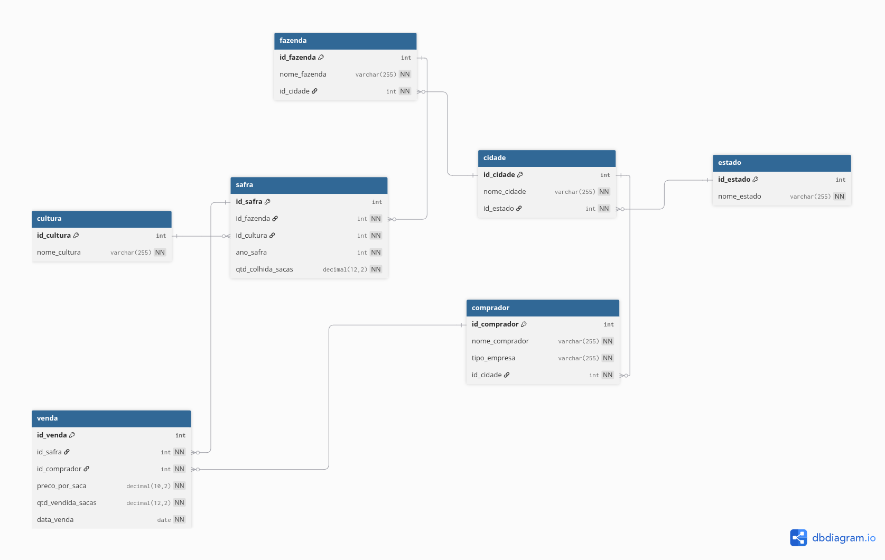

# Projeto agrodados-sql
Banco de dados relacional de safras e vendas do agronegócio, com dados fictícios (MySQL)

## Modelo de dados
Nosso modelo tem 7 tabelas, todas elas estão ligadas por relações 1:N:

- `estado` -> `cidade`
- `cidade` -> `fazenda`
- `cultura` -> `safra`
- `cidade` -> `comprador`
- `fazenda` -> `safra`
- `comprador` -> `venda`
- `safra` -> `venda`

A safra resolve o modelo N:N entre `fazenda` e `cultura`. A `venda` liga o `comprador` à `safra`.

O modelo completo em texto está em [`docs/modelo.dbml`](docs/modelo.dbml)

Segue imagem do Diagrama completo


## Schema
Primeiro eu criei o banco chamado *agrodados*:
```sql
CREATE DATABASE agrodados
CHARACTER SET utf8mb4
COLLATE utf8mb4_0900_ai_ci;
```

**Importante**: eu usei dois comandos diferentes para criar o banco:
- `CHARACTER SET utf8mb4`: serve para o banco conseguir identificar caracteres tipo *'é'*, *'á'*, *'í'*, etc... Por causa do comando `utf8mb4` ele também possibilita que o banco consiga reconhecer emojis, e outros acentos.
- `COLLATE utf8mb4_0900_ai_ci`: esse comando serve para comparar e ordenar os caracteres, por causa do `ai` o *'é'* se torna a mesma coisa que *'e'* e por causa do `ci` ele ignora maiúscula e minúscula, para ele são os mesmos caracteres, ele não diferencia.

## Criando um usuário chamado *projeto*
Esse usuário terá acesso full somente ao banco *agrodados*.
```sql
CREATE USER projeto@localhost IDENTIFIED BY 'SENHAAQUI';
GRANT ALL ON agrodados.* TO projeto@localhost;
SHOW GRANTS FOR projeto@localhost;
```
**Resultado**:
```
Grants for projeto@localhost
GRANT USAGE ON *.* TO `projeto`@`localhost`                
GRANT ALL PRIVILEGES ON `agrodados`.* TO `projeto`@`localhost`
```

Também vou forçar o banco a proibir que uma combinação de dados seja inserida novamente, para isso usamos o `UNIQUE`. A tabela que vou setar isso é a *safra*, fazemos da seguinte forma:
```sql
CONSTRAINT uq_safra UNIQUE (id_fazenda, id_cultura, ano_safra)
```
O `uq_safra` impede que a combinação *id_fazenda* + *id_cultura* + *ano_safra* se repitam, ou seja, se alguém tentar inserir duas vezes no banco a combinação abaixo, vai ser recusado:
- *id_fazenda* = 1;
- *id_cultura* = 1;
- *ano_safra* = 2026;

Também vamos delimitar algumas coisas na tabela *safra* com o `CHECK`. vamos fazer duas coisas.
- A primeira:
```sql
CONSTRAINT chk_safra_qtd CHECK (qtd_colhida_sacas > 0)
```
Dessa forma, obrigamos que o número de sacas colhidas seja maior do que 0, pois não faz sentido uma fazenda colher -1 saca, também não faz sentido uma fazenda colher 0 sacas, pois nem haveria colheita.
- A segunda:
```sql
CONSTRAINT chk_safra_ano CHECK (ano_safra BETWEEN 2000 AND 2100)
```
Também estou setando que o *ano_safra*, só aceitará valores que fiquem entre 2000 e 2100. Pois nesse projeto não faz sentido uma colheita que ocorreu no ano 1999 ou 2101, são valores muito baixo ou muito alto.

Então a criação da tabela *safra* ficará assim:
```sql
CREATE TABLE safra (
    id_safra INT AUTO_INCREMENT,
    id_fazenda INT NOT NULL,
    id_cultura INT NOT NULL,
    ano_safra INT NOT NULL,
    qtd_colhida_sacas DECIMAL(12,2) NOT NULL,
    PRIMARY KEY (id_safra),
    CONSTRAINT fk_safra_fazenda FOREIGN KEY (id_fazenda) REFERENCES fazenda(id_fazenda),
    CONSTRAINT fk_safra_cultura FOREIGN KEY (id_cultura) REFERENCES cultura(id_cultura),
    CONSTRAINT uq_safra UNIQUE(id_fazenda, id_cultura, ano_safra),
    CONSTRAINT chk_safra_qtd CHECK (qtd_colhida_sacas > 0),
    CONSTRAINT chk_safra_ano CHECK (ano_safra BETWEEN 2000 AND 2100)
);
```
Também adicionei o `UNIQUE` na tabela *estado*, para que o *nome_estado* seja unico:
```sql
CONSTRAINT uq_estado UNIQUE (nome_estado);
```
Ficou assim:
```sql
CREATE TABLE estado (
    id_estado INT AUTO_INCREMENT,
    nome_estado VARCHAR(255) NOT NULL,
    PRIMARY KEY (id_estado),
    CONSTRAINT uq_estado UNIQUE (nome_estado)
);
```
Mesma coisa com a tabela *cultura*:
```sql
CONSTRAINT uq_cultura UNIQUE (nome_cultura);
```
Ficou assim:
```sql
CREATE TABLE cultura (
    id_cultura INT AUTO_INCREMENT,
    nome_cultura VARCHAR(255) NOT NULL,
    PRIMARY KEY (id_cultura),
    CONSTRAINT uq_cultura UNIQUE (nome_cultura)
);
```

Também adicionei dois CHECKs na tabela vendas:
```sql
CREATE TABLE venda (
    id_venda INT AUTO_INCREMENT,
    id_safra INT NOT NULL,
    id_comprador INT NOT NULL,
    preco_por_saca DECIMAL(10,2) NOT NULL,
    qtd_vendida_sacas DECIMAL(12,2) NOT NULL,
    data_venda DATE NOT NULL,
    PRIMARY KEY (id_venda),
    CONSTRAINT fk_venda_safra FOREIGN KEY (id_safra) REFERENCES safra(id_safra),
    CONSTRAINT fk_venda_comprador FOREIGN KEY (id_comprador) REFERENCES comprador(id_comprador),
    CONSTRAINT chk_venda_preco CHECK (preco_por_saca > 0),
    CONSTRAINT chk_venda_qtd CHECK (qtd_vendida_sacas > 0)
);
```