# Projeto agrodados-sql
Banco de dados relacional de safras e vendas do agronegócio, com dados fictícios (MySQL)

## Modelo de dados
Nosso modelo tem 7 tabelas, todas elas estão ligadas por relações 1:N:

- `estado` -> `cidade`
- `cidade` -> `fazenda`
- `cultura` -> `safra`
- `cidade` -> `comprador`
- `fazenda` -> `safra`
- `comprador` -> `venda`
- `safra` -> `venda`

A safra resolve o modelo N:N entre `fazenda` e `cultura`. A `venda` liga o `comprador` à `safra`.

O modelo completo em texto está em [`docs/modelo.dbml`](docs/modelo.dbml)

Segue imagem do Diagrama completo


## Schema
Primeiro eu criei o banco chamado *agrodados*:
```sql
CREATE DATABASE agrodados
CHARACTER SET utf8mb4
COLLATE utf8mb4_0900_ai_ci;
```

**Importante**: eu usei dois comandos diferentes para criar o banco:
- `CHARACTER SET utf8mb4`: serve para o banco conseguir identificar caracteres tipo *'é'*, *'á'*, *'í'*, etc... Por causa do comando `utf8mb4` ele também possibilita que o banco consiga reconhecer emojis, e outros acentos.
- `COLLATE utf8mb4_0900_ai_ci`: esse comando serve para comparar e ordenar os caracteres, por causa do `ai` o *'é'* se torna a mesma coisa que *'e'* e por causa do `ci` ele ignora maiúscula e minúscula, para ele são os mesmos caracteres, ele não diferencia.

## Criando um usuário chamado *projeto*
Esse usuário terá acesso full somente ao banco *agrodados*.
```sql
CREATE USER projeto@localhost IDENTIFIED BY 'TROQUE_SENHA_PROJETO';
GRANT ALL ON agrodados.* TO projeto@localhost;
SHOW GRANTS FOR projeto@localhost;
```
**Resultado**:
```
Grants for projeto@localhost
GRANT USAGE ON *.* TO `projeto`@`localhost`                
GRANT ALL PRIVILEGES ON `agrodados`.* TO `projeto`@`localhost`
```

Também vou forçar o banco a proibir que uma combinação de dados seja inserida novamente, para isso usamos o `UNIQUE`. A tabela que vou setar isso é a *safra*, fazemos da seguinte forma:
```sql
CONSTRAINT uq_safra UNIQUE (id_fazenda, id_cultura, ano_safra)
```
O `uq_safra` impede que a combinação *id_fazenda* + *id_cultura* + *ano_safra* se repitam, ou seja, se alguém tentar inserir duas vezes no banco a combinação abaixo, vai ser recusado:
- *id_fazenda* = 1;
- *id_cultura* = 1;
- *ano_safra* = 2026;

Também vamos delimitar algumas coisas na tabela *safra* com o `CHECK`. vamos fazer duas coisas.
- A primeira:
```sql
CONSTRAINT chk_safra_qtd CHECK (qtd_colhida_sacas > 0)
```
Dessa forma, obrigamos que o número de sacas colhidas seja maior do que 0, pois não faz sentido uma fazenda colher -1 saca, também não faz sentido uma fazenda colher 0 sacas, pois nem haveria colheita.
- A segunda:
```sql
CONSTRAINT chk_safra_ano CHECK (ano_safra BETWEEN 2000 AND 2100)
```
Também estou setando que o *ano_safra*, só aceitará valores que fiquem entre 2000 e 2100. Pois nesse projeto não faz sentido uma colheita que ocorreu no ano 1999 ou 2101, são valores muito baixo ou muito alto.

Então a criação da tabela *safra* ficará assim:
```sql
CREATE TABLE safra (
    id_safra INT AUTO_INCREMENT,
    id_fazenda INT NOT NULL,
    id_cultura INT NOT NULL,
    ano_safra INT NOT NULL,
    qtd_colhida_sacas DECIMAL(12,2) NOT NULL,
    PRIMARY KEY (id_safra),
    CONSTRAINT fk_safra_fazenda FOREIGN KEY (id_fazenda) REFERENCES fazenda(id_fazenda),
    CONSTRAINT fk_safra_cultura FOREIGN KEY (id_cultura) REFERENCES cultura(id_cultura),
    CONSTRAINT uq_safra UNIQUE(id_fazenda, id_cultura, ano_safra),
    CONSTRAINT chk_safra_qtd CHECK (qtd_colhida_sacas > 0),
    CONSTRAINT chk_safra_ano CHECK (ano_safra BETWEEN 2000 AND 2100)
);
```
Também adicionei o `UNIQUE` na tabela *estado*, para que o *nome_estado* seja unico:
```sql
CONSTRAINT uq_estado UNIQUE (nome_estado);
```
Ficou assim:
```sql
CREATE TABLE estado (
    id_estado INT AUTO_INCREMENT,
    nome_estado VARCHAR(255) NOT NULL,
    PRIMARY KEY (id_estado),
    CONSTRAINT uq_estado UNIQUE (nome_estado)
);
```
Mesma coisa com a tabela *cultura*:
```sql
CONSTRAINT uq_cultura UNIQUE (nome_cultura);
```
Ficou assim:
```sql
CREATE TABLE cultura (
    id_cultura INT AUTO_INCREMENT,
    nome_cultura VARCHAR(255) NOT NULL,
    PRIMARY KEY (id_cultura),
    CONSTRAINT uq_cultura UNIQUE (nome_cultura)
);
```

Também adicionei dois CHECKs na tabela vendas:
```sql
CREATE TABLE venda (
    id_venda INT AUTO_INCREMENT,
    id_safra INT NOT NULL,
    id_comprador INT NOT NULL,
    preco_por_saca DECIMAL(10,2) NOT NULL,
    qtd_vendida_sacas DECIMAL(12,2) NOT NULL,
    data_venda DATE NOT NULL,
    PRIMARY KEY (id_venda),
    CONSTRAINT fk_venda_safra FOREIGN KEY (id_safra) REFERENCES safra(id_safra),
    CONSTRAINT fk_venda_comprador FOREIGN KEY (id_comprador) REFERENCES comprador(id_comprador),
    CONSTRAINT chk_venda_preco CHECK (preco_por_saca > 0),
    CONSTRAINT chk_venda_qtd CHECK (qtd_vendida_sacas > 0)
);
```

## Inserindo dados na tabela
Eu pedi para a IA Claude da Anthropic gerar um arquivo sql para mim com dados fictícios para inserir no banco. Ela gerou 500 registros para cada tabela, com exceção da tabela *estado* que são os estados oficiais do Brasil e *cultura* que nomes de culturas que realmente existem. O arquivo está localizado em: [`sql/02_dados_ficticios.sql`](sql/02_dados_ficticios.sql).

## Iniciando a Análise dos dados
Segue o arquivo completo: [`sql/03_analise_dos_dados.sql`](sql/03_analise_dos_dados.sql)

Eu pedi para a IA Claude montar 10 exercícios para eu resolver, baseado nos dados que foram gerados. A partir desses exercícios eu consegui realizar uma análise dos dados e obter alguns insights, segue abaixo a minha análise:

## Receita
1. Quanto o sistema faturou no total, em cada ano de venda?
```sql
SELECT
    YEAR(data_venda) AS ano,
    ROUND(SUM(v.preco_por_saca * v.qtd_vendida_sacas)) AS total
FROM venda AS v
GROUP BY YEAR(v.data_venda)
ORDER BY YEAR(v.data_venda) ASC;
```
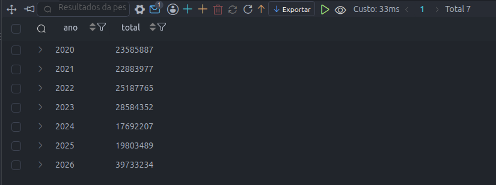
Com esse script eu consegui que a coluna de *ano* ficasse toda ordenada do menor ano(2020) para o maior ano(2026), e o total de faturamento de cada ano.

2. Quais são as 10 fazendas que mais faturaram?
```sql
SELECT
    f.nome_fazenda AS nome,
    ROUND(SUM(v.preco_por_saca * v.qtd_vendida_sacas), 2) AS faturamento
FROM fazenda AS f
INNER JOIN safra AS s
    ON s.id_fazenda = f.id_fazenda
INNER JOIN venda AS v
    ON v.id_safra = s.id_safra
GROUP BY nome
ORDER BY faturamento DESC
LIMIT 10;
```
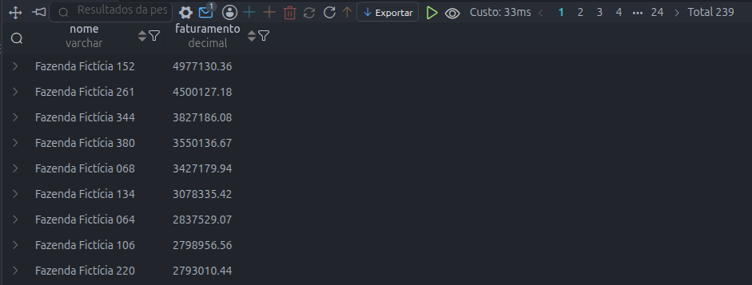
Com essa análise eu observei as 10 fazendas com os maiores faturamentos, sendo a *"Fazenda Fictícia 152"* com um faturamento total de *4977130.36*. O faturamento está ordenado do maior para o menor.

3. Qual cultura gera mais receita? E qual tem o maior preço médio por saca?
- **Cultura que gera mais receita:**
```sql
SELECT c.nome_cultura,
       ROUND(SUM(v.preco_por_saca * v.qtd_vendida_sacas), 2) AS faturamento
FROM cultura AS c
INNER JOIN safra AS s ON c.id_cultura = s.id_cultura
INNER JOIN venda AS v ON v.id_safra = s.id_safra
GROUP BY c.nome_cultura
ORDER BY faturamento DESC;
```
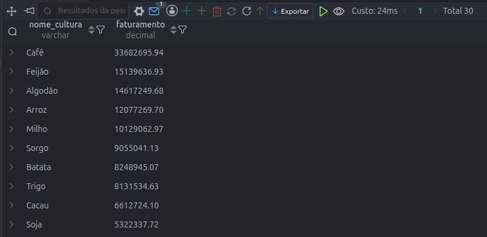
- **Cultura com maior preço médio:**
```sql
SELECT
    c.nome_cultura,
    ROUND(AVG(v.preco_por_saca), 2) AS preco_medio 
FROM cultura AS c
INNER JOIN safra AS s
    ON c.id_cultura = s.id_cultura
INNER JOIN venda AS v
    ON v.id_safra = s.id_safra
GROUP BY nome_cultura
ORDER BY preco_medio DESC;
```

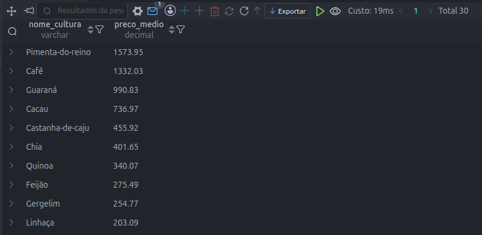
Com essas duas consultas eu consegui visualizar que a cultura com maior receita é o *Café* e a cultura que teve um maior preço médio é a *Pimenta-do-reino*.

4. Qual é a participação de cada estado na receita total, em %?
```sql
SELECT
    e.nome_estado,
    ROUND(
        SUM(v.preco_por_saca * v.qtd_vendida_sacas) / (
            SELECT SUM(v.preco_por_saca * v.qtd_vendida_sacas) FROM venda AS v
        ) * 100, 2
    ) AS percentual_venda
FROM venda AS v
INNER JOIN comprador AS c
    ON v.id_comprador = c.id_comprador
INNER JOIN cidade AS cid
    ON cid.id_cidade = c.id_cidade
INNER JOIN estado AS e
    ON e.id_estado = cid.id_estado
GROUP BY e.nome_estado
ORDER BY percentual_venda DESC;
```
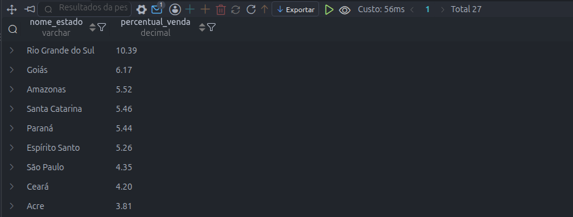
A consulta mostra que o estado do Rio Grande do Sul teve um percentual de 10.39% na receita total. Sendo o estado que mais contribuiu (dado fictício).

## Buracos nos dados
5. Quais fazendas nunca registraram uma safra?
```sql
SELECT
    f.nome_fazenda,
    s.id_cultura
FROM fazenda AS f
LEFT JOIN safra AS s
    ON f.id_fazenda = s.id_fazenda
WHERE s.id_safra IS NULL
ORDER BY f.nome_fazenda ASC;
```
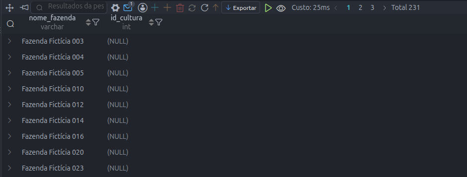
Essa consulta mostra as fazendas que nunca registraram uma safra, sendo um total de 231 fazendas.

6. Quais compradores nunca compraram nada?
```sql
SELECT
    c.nome_comprador,
    c.tipo_empresa,
    v.id_venda
FROM comprador AS c
LEFT JOIN venda AS v
    ON c.id_comprador = v.id_comprador
WHERE v.id_comprador IS NULL
ORDER BY c.nome_comprador ASC;
```
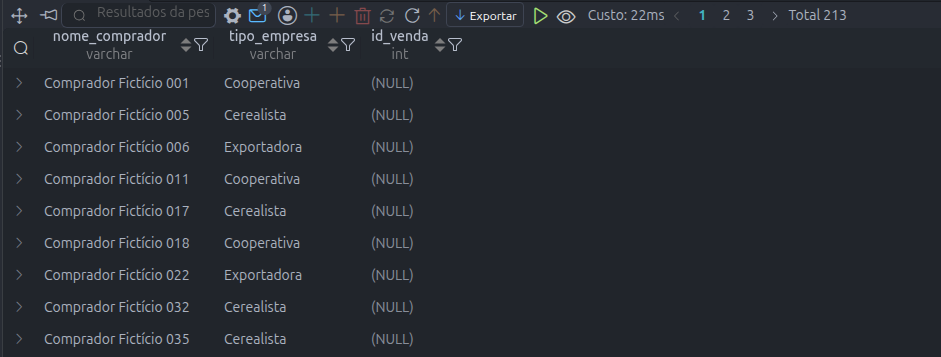
A consulta retornou um total de 213 compradores que nunca fizeram uma compra.

7. Quais safras foram colhidas mas ainda não tiveram nenhuma venda?
```sql
SELECT
    s.id_safra,
    s.id_fazenda,
    v.id_venda
FROM safra AS s
LEFT JOIN venda AS v
    ON s.id_safra = v.id_safra
WHERE v.id_venda IS NULL
ORDER BY s.id_safra ASC;
```
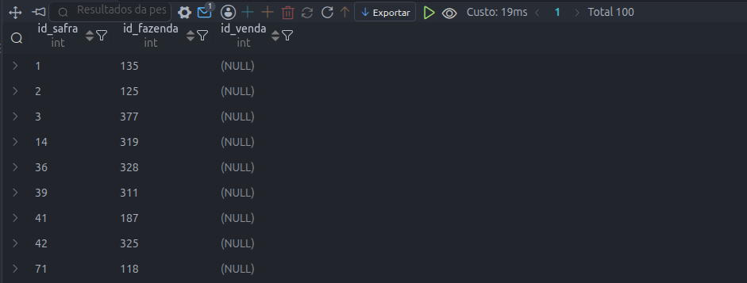
A consulta mostra 100 registros de safras que foram colhidas mas não tiveram 1 venda.

8. Há estados sem nenhuma fazenda cadastrada?
```sql
SELECT
    e.id_estado,
    COUNT(f.id_fazenda) AS qtd_faz_por_estado
FROM estado AS e
LEFT JOIN cidade AS c
    ON e.id_estado = c.id_estado
LEFT JOIN fazenda AS f
    ON c.id_cidade = f.id_cidade
GROUP BY e.id_estado
HAVING qtd_faz_por_estado = 0;
```
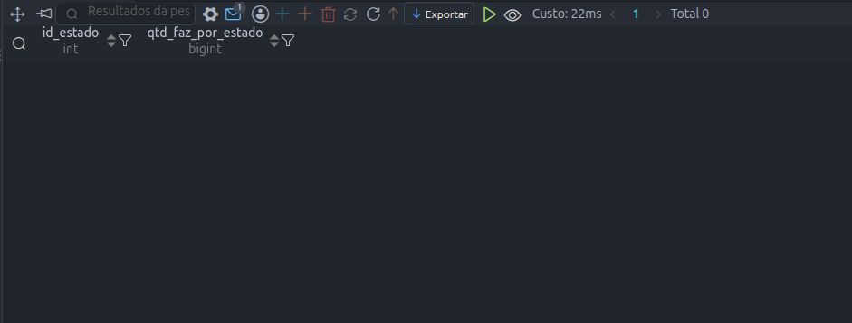
Não existem registros de estados que não possuem fazenda cadastrada.

## Estoque e produtividade
9. De cada safra, quantas sacas ainda não foram vendidas?
```sql
SELECT
    s.id_safra,
    c.nome_cultura,
    (MAX(s.qtd_colhida_sacas) - COALESCE(SUM(v.qtd_vendida_sacas), 0)) AS qtd_nao_vendidas
FROM safra AS s
LEFT JOIN venda AS v
    ON v.id_safra = s.id_safra
LEFT JOIN cultura AS c
    ON s.id_cultura = c.id_cultura
GROUP BY s.id_safra
ORDER BY qtd_nao_vendidas ASC;
```
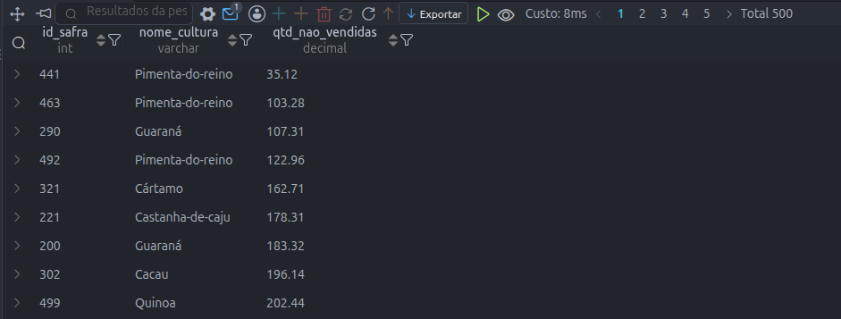
A consulta mostra dados repetidos, mas é porque os dados que foram inseridos são fictícios, mas podemos ver que "são diferentes" por causa do *id_safra*.

10. Quais safras já venderam mais de 70% do que colheram?
```sql
SELECT
    s.id_safra,
    c.nome_cultura,
    MAX(s.qtd_colhida_sacas) AS total_colhido,
    SUM(v.qtd_vendida_sacas) AS total_vendido,
    (SUM(v.qtd_vendida_sacas) * 100.0 / MAX(s.qtd_colhida_sacas)) AS percentual_vendido
FROM safra AS s
INNER JOIN venda AS v
    ON v.id_safra = s.id_safra
INNER JOIN cultura AS c
    ON s.id_cultura = c.id_cultura
GROUP BY s.id_safra
HAVING SUM(v.qtd_vendida_sacas) > (MAX(s.qtd_colhida_sacas) * 0.70)
ORDER BY percentual_vendido ASC;
```
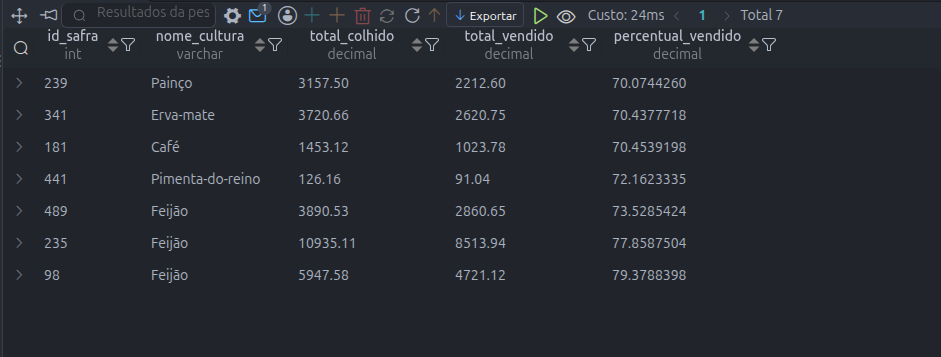
Podemos ver um registro de apenas 7 safras que tiveram mais de 70% de suas colheitas vendidas.

**Com esses 10 exercícios a análise dos dados foi concluída.**

## Criando novos usuários e definindo as permissões
Para essa etapa do projeto eu criei dois usuários fictícios.
- Primeiro: *leitor*:
```sql
CREATE USER 'leitor'@'localhost' IDENTIFIED BY 'TROQUE_SENHA_LEITOR';
```
- Segundo: *app_agro*:
```sql
CREATE USER 'app_agro'@'localhost' IDENTIFIED BY 'TROQUE_SENHA_APP_AGRO';
```

Depois disso eu defini as devidas permissões para cada usuário.
- O usuário *leitor* eu dei permissão apenas para visualizar uma view que eu criei:
```sql
GRANT SELECT ON agrodados.vw_faturamento_fazenda TO 'leitor'@'localhost';
```
- O usuário *app_agro* eu dei permissão para ```SELECT, INSERT, UPDATE``` em todas as tabelas do banco *agrodados*.

## Como rodar o projeto:
Os arquivos *sql* estão todos na pasta sql/. Eles devem ser rodados na seguinte ordem:

1. `00_criando_usuario.sql`: cria o usuário `projeto` (deve ser executado como root e a senha de placeholder deve ser trocada por uma senha de sua escolha).
2. `01_schema.sql`: esse arquivo cria o banco de dados e as 7 tabelas que pertencem ao banco. Mais recomendável rodar como usuário root.
3. `02_dados_ficticios.sql`: esse arquivo cria os dados fictícios que a IA Claude da Anthropic gerou para mim, apenas de exemplo para popular o banco de dados e eu conseguir fazer as análises.
4. `03_analise_dos_dados.sql`: as 11 consultas resolvendo os 10 exercícios para a análise dos dados.
5. `04_usuarios_e_permissoes.sql`: o `CREATE VIEW` deve ser rodado com o usuário `projeto`. A criação dos usuários e as permissões `GRANT` devem ser rodadas com o usuário root, as senhas de placeholders devem ser trocadas também.

## Testes de segurança
Para provar que as regras funcionam de verdade, eu tentei fazer coisas que o banco **não** deveria permitir. Os testes de inserção rodaram dentro de uma transação com `ROLLBACK`. Os de permissão usaram `WHERE id_venda = -1` e uma tabela que não existe no `DROP`, para que nada fosse alterado caso a regra falhasse.

### Regras do banco
| # | Teste | Resultado |
|---|---|---|
| 1 | Inserir safra com `0` sacas | Barrado: `Check constraint 'chk_safra_qtd' is violated` |
| 2 | Inserir safra com ano `1999` | Barrado: `Check constraint 'chk_safra_ano' is violated` |
| 3 | Inserir o estado `Acre` de novo | Barrado: `Duplicate entry 'Acre' for key 'estado.uq_estado'` |
| 4 | Inserir safra de uma fazenda inexistente (id 99999) | Barrado: erro de chave estrangeira (`Cannot add or update a child row`) |

### Permissões
| # | Usuário | Teste | Resultado |
|---|---|---|---|
| 5 | `leitor` | `SELECT` na view `vw_faturamento_fazenda` | Funcionou |
| 6 | `leitor` | `SELECT` direto na tabela `fazenda` | Barrado: `SELECT command denied` |
| 7 | `leitor` | `DELETE` na tabela `venda` | Barrado: `DELETE command denied` |
| 8 | `app_agro` | `SELECT` na tabela `estado` | Funcionou |
| 9 | `app_agro` | `DELETE` na tabela `venda` | Barrado: `DELETE command denied` |
| 10 | `app_agro` | `DROP TABLE` | Barrado: `DROP command denied` |

## Limitações
- O schema **não impede** vender mais sacas do que foram colhidas (isso exigiria um trigger). Nos dados gerados isso não acontece, mas o banco não garante.
- Considerei saca de 60 kg para todas as culturas, o que é uma simplificação.
- O usuário `app_agro` tem `UPDATE` em todas as tabelas e colunas, então poderia alterar, por exemplo, o preço de uma venda já registrada. Num sistema real eu restringiria por tabela ou coluna.
- Os dados são fictícios e gerados por IA. As cidades não têm relação geográfica real com os estados, e preços e quantidades são aleatórios dentro de uma faixa por cultura. Os resultados da análise **não representam o mercado real**.
- Não fiz análise de desempenho (`EXPLAIN`, índices).
- Não há backup, criptografia nem logs de auditoria.

## Privacidade e LGPD
Este projeto **não trata dados pessoais**: fazendas e compradores são empresas inventadas, e não existe CPF, telefone, endereço nem nome de pessoa em nenhuma tabela. Por isso avaliei que um Relatório de Impacto (RIPD) não é necessário.

Um alerta: com dados reais, `nome_fazenda` e `nome_comprador` poderiam identificar um produtor que seja pessoa física, e aí passam a ser dado pessoal. Nesse caso todas as exigências da lei passariam a valer.

Boas práticas que apliquei:
- **Minimização:** só guardo o que a análise precisa, sem dado pessoal.
- **Privilégio mínimo:** três usuários, cada um só com o que precisa (`projeto`, `leitor` e `app_agro`).
- **Acesso por view:** o `leitor` só enxerga o faturamento agregado, nunca as tabelas.
- **Integridade na origem:** `PRIMARY KEY`, `FOREIGN KEY`, `UNIQUE` e `CHECK` no próprio banco.
- **Sem segredos no Git:** senhas só como `TROQUE_SENHA_*`, e o `.gitignore` bloqueia `.env`, chaves e dumps.

**Isso mostra boas práticas, não é "conformidade com a LGPD".** Para um sistema com dados reais ainda precisariam de base legal, direitos do titular, criptografia em repouso, logs de auditoria, backup criptografado, política de retenção, canal do titular e plano de resposta a incidentes.

# Com isso eu finalizo o projeto.